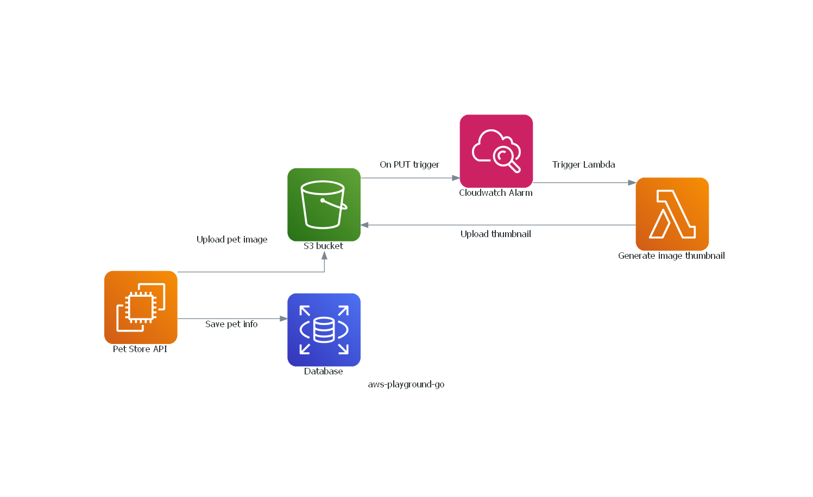

# A playground for testing AWS services and learning GO at the same time

## Implementation of the Swagger PetStore API: https://petstore3.swagger.io/

#### Save pets info into RDS mysql DB
- If connecting to RDS via user and password, created user must be granted rights to select, insert, update and delete 

#### Upload pet images to S3 bucket
- User must have an IAM policy that grants the right to PUT objects to the bucket

#### Trigger lambda on S3 bucket image upload (via CloudWatch alarms) to generate thumbnails & save to another bucket

###### Use github.com/blushft/go-diagrams to generate a diagram of the services used